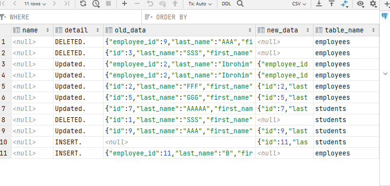

1 savol

```sql
create table university
(
    id serial primary key,
    name varchar(250) not null ,
    address varchar(250),
    country varchar(250),
    number_subject int not null

);

create table departments(
    id serial references university(id),
    adelt_section int,
    youth_departments int,
    address varchar(250)

);
create table faculties(
    faculties_id serial primary key,
    name varchar(50),
    address varchar(50),
    study_duration int not null
);
create table employees(
    employee_id serial references university(id),
    last_name varchar(50) not null ,
    first_name varchar(50),
    address varchar(50),
    city varchar(50),
    country varchar(50)
);
create table students(
    id serial primary key,
    last_name varchar(250) not null ,
    first_name varchar(250) not null ,
    course int not null,
    mark int,
    address varchar(250) not null
);

create table groups(
    id serial primary key,
    name varchar(50),
    number_groups int
);

create table sciences(
    id serial references students(id),
    name varchar(50) not null,
    subject_teacher varchar(250) not null
);
create or replace trigger tickets_update_delete_trigger
    after update or delete
    on tickets
    for each row
execute procedure airport_update_and_delete_trigger_func();


create table logs
(
    id         serial primary key,
    name       varchar(255),
    detail     text,
    old_data   json,
    new_data   json,
    table_name varchar(255)
);
```


2 savol


3 SAVOL

```sql
select * from university where name like 'A%';
```

result


4 savol
```sql
select * from students order by mark desc limit 5;
```

result


5 savol

```sql
select groups.id,
       groups.number_groups,
       students.mark
       from groups inner join students on groups.id=students.id;
```
result


6 savol

```sql

select st.id,
       st.last_name,
       st.address,
       st.course,
       u.name as university_namme,
       g.name as group_name
       from students st inner join university u on st.address = u.address inner join groups g on st.mark = g.mark;
```
result


7 savol


4 masalaga view

```sql
create or replace view students_mark_vies as
select * from students order by mark desc limit 5;
```

result


6 masalaga view

```sql
create or replace view lesson_6_view as

select st.id,
       st.last_name,
       st.address,
       st.course,
       u.name as university_namme,
       g.name as group_name
       from students st inner join university u on st.address = u.address inner join groups g on st.mark = g.mark;

```

result


8 savol
1 chi tebil


```sql


create table logs
(
    id         serial primary key,
    name       varchar(255),
    detail     text,
    old_data   json,
    new_data   json,
    table_name varchar(255)
);

create or replace trigger tickets_update_delete_trigger
    after update or delete or insert
    on employees
    for each row
execute procedure employees_delete_update_trigger();


create or replace function employees_delete_update_trigger()
    returns trigger
    language plpgsql
as
$$
declare
    value text := 'employees';
BEGIN
    if tg_op = 'UPDATE' THEN
        insert into logs(detail, old_data, new_data, table_name)
        values ('Updated.', row_to_json(OLD), row_to_json(NEW),value );
        return NEW;
    elsif tg_op ='DELETE' THEN
        insert into logs(detail, old_data, table_name)
        values ('DELETED.', row_to_json(OLD),value);
        return OLD;
     elsif tg_op ='INSERT' THEN
        insert into logs(detail, old_data, table_name)
        values ('INSERT.', row_to_json(new),value);
        return new;
    END IF;
end;
$$;


```

result




2 chi tebil

```sql
create or replace trigger students_update_delete_trigger
    after update or delete or insert
    on students
    for each row
execute procedure students_delete_update_trigger();


create or replace function students_delete_update_trigger()
    returns trigger
    language plpgsql
as
$$
declare
    value text := 'students';
BEGIN
    if tg_op = 'UPDATE' THEN
        insert into logs(detail, old_data, new_data, table_name)
        values ('Updated.', row_to_json(OLD), row_to_json(NEW),value );
        return NEW;
    elsif tg_op ='DELETE' THEN
        insert into logs(detail, old_data, table_name)
        values ('DELETED.', row_to_json(OLD),value);
        return OLD;
     elsif tg_op ='INSERT' THEN
        insert into logs(detail, new_data, table_name)
        values ('INSERT.', row_to_json(new),value);
        return new;
    END IF;
end;
$$;

```

result


